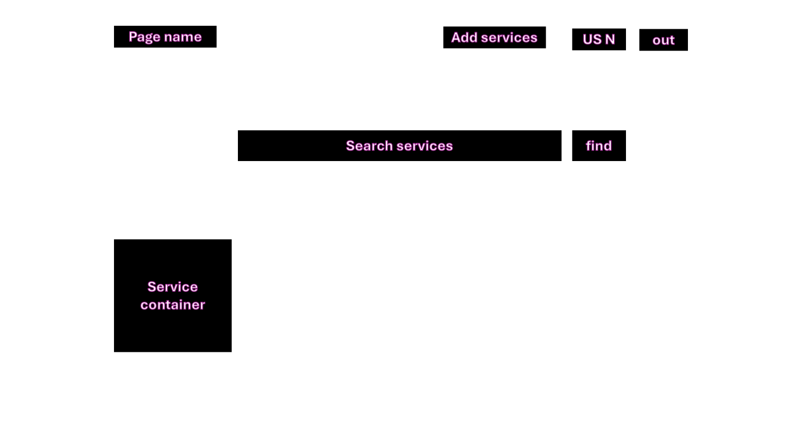
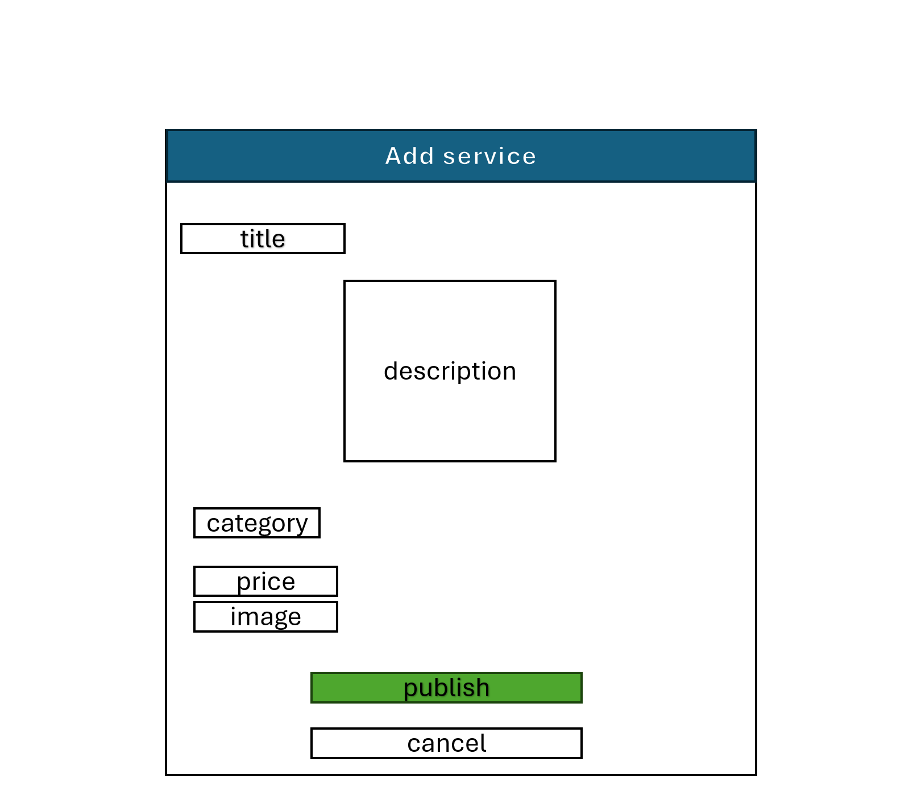

# ServiceLink - Online Service Marketplace

ServiceLink is a full-stack marketplace platform built with Django, designed to connect service providers with customers. The application allows users to create professional listings, upload images, search for services, and manage their personal portfolio with real-time value calculations.

* **Live Project**: [https://online-service-sorin-c2b78d35ddee.herokuapp.com/](https://online-service-sorin-c2b78d35ddee.herokuapp.com/)
* **GitHub Repository**: [https://github.com/Sori678/online-service-marketplace](https://github.com/Sori678/online-service-marketplace)

## 1. Project Goals

The project aims to provide a secure environment for local commerce:

* **User Empowerment**: Allow individuals to monetize their skills easily.
* **Reliability**: Use a robust backend to ensure data persistence and security.
* **Clean UX**: Provide a responsive interface that works on all devices.

## 2. User Experience (UX)

### User Stories

* **As a Visitor**: I want to browse services and use the search bar to find specific offerings.
* **As a Registered User**: I want to post new services with descriptions, prices, and images.
* **As an Owner**: I want to edit or delete my listings to keep my information accurate.
* **As a Professional**: I want to see the total financial value of my active ads on my dashboard.

### Design Process

* **Wireframes**: Initial sketches were created to ensure a mobile-first approach.
* **Home Page Layout**:

* **Add/Edit Service Form**:

* **Color Palette**: A professional combination of blue and white was chosen to convey trust and clarity in a marketplace environment.
* **Typography**: Clean sans-serif fonts (Bootstrap default) are used to maintain high readability across different screen sizes.

## 3. Agile Methodology

This project was developed using Agile principles. Tasks were managed via GitHub Projects, utilizing User Stories with specific Acceptance Criteria and prioritization (Must Have/Should Have labels).

The project board can be found here: [GitHub Project Board](https://github.com/users/Sori678/projects/20)

## 4. Features

* **Authentication**: Secure Login/Register/Logout flow using Django Allauth.
* **CRUD Management**: Full control over service listings (Create, Read, Update, Delete).
* **Image Processing**: Dynamic image uploading.
* **Portfolio Dashboard**: A private "My Ads" page for every user with total value calculation.
* **Search Engine**: Keyword-based filtering for the main service list.

## 5. Testing and Validation

### Validation Results

* **Python (PEP8)**: All code in `marketplace/views.py` and `marketplace/models.py` has been validated to comply with PEP8 standards.
* **HTML**: Validated using the W3C Markup Validation Service.
* **CSS**: Validated using the W3C CSS Validation Service (Jigsaw).

### Manual Testing

| Test ID | Feature | Expected Result | Result |
| --- | --- | --- | --- |
| **t7** | Sign-Up | Form validates correctly; creates user. | Pass |
| **t8-t9** | CRUD Forms | Data is correctly saved to the database. | Pass |
| **t14-t15** | Deletion | Confirm prompt appears before removing data. | Pass |
| **t16** | Search | Filtered results match the search keyword. | Pass |

## 6. Deployment

### Heroku Deployment

The project is deployed on Heroku following these steps:

1. Create a new app on Heroku.
2. Set the environment variables (**Config Vars**): `SECRET_KEY`, `DATABASE_URL`, and `DISABLE_COLLECTSTATIC=1`.
3. Link the GitHub repository and select the main branch for deployment.
4. Run migrations via the Heroku console: `python manage.py migrate`.

### Local Installation

To run the project locally:

1. Clone the repo: `git clone https://github.com/Sori678/online-service-marketplace.git`
2. Install dependencies: `pip install -r requirements.txt`
3. Run migrations: `python manage.py migrate`
4. Start the server: `python manage.py runserver`

## 7. Technologies Used

* **Languages**: Python, HTML5, CSS3, JavaScript.
* **Framework**: Django.
* **Libraries**: Pillow, Django-Allauth, Gunicorn (for Heroku).
* **Database**: Heroku Postgres (Production), SQLite3 (Development).

## 8. Credits

* **Code Institute**: For the pedagogical framework and support.
* **Django Documentation**: For technical guidance.